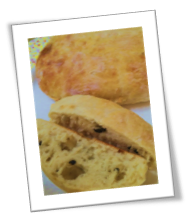

+++
title = "About"
description = "About me and this blog"
date = "2018-05-26T14:24:11+09:00"
+++

# Patrick Yu

{}
A question not asked is a door not opened.
{}

이것저것 관심만 많은 **잡식성 개발자**입니다.

**빵**을 굽습니다.

빵보다는 **빵 만들기**를 즐깁니다.

**귀촌**을 꿈꿉니다.

---

An **omnivorous developer**, only have interests in variety fields.

Bake **bread**.

Enjoy **making bread** rather than bread itself.

Dream of **returning to rural**.

# Awesome Patrick

Awesome Patrick은 제 개인적 관심사들을 정리하기 위한 블로그입니다. 

[GitHub Pages](https://pages.github.com/)에서 호스팅 중입니다.

[Hugo](https://gohugo.io/)를 이용해 컨텐츠를 제작합니다.

[Yoshiharu Yamashita](http://yoshiharuyamashita.com/)의 [Blackburn](https://github.com/yoshiharuyamashita/blackburn)을 기반으로한 수정 테마를 사용중입니다.

## Hugo를 사용하는 이유

GitHub Pages에서 기본으로 지원하는 [Jekyll](https://jekyllrb.com/)을 사용하려 했으나 Ruby, bundler, jekyll 등 다양한 환경에서 컨텐츠를 제작하기 위해서 설치하고 설정해야 하는 것들이 너무 많더군요.

Hugo는 실행파일 하나! 그래서 선택했습니다.

---

Awesome Patrick is a blog for managing my personal interests.

Being hosted on [GitHub Pages](https://pages.github.com/).

Making contents using [Hugo](https://gohugo.io/).

Using modified [Blackburn](https://github.com/yoshiharuyamashita/blackburn) theme originally made by [Yoshiharu Yamashita](http://yoshiharuyamashita.com/).

## The reason for using Hugo

[Jekyll](https://jekyllrb.com/), which is the default tool supported by Github Pages, needs many installations and settings.

Hugo, while, needs only one execution file! This is why I use it.